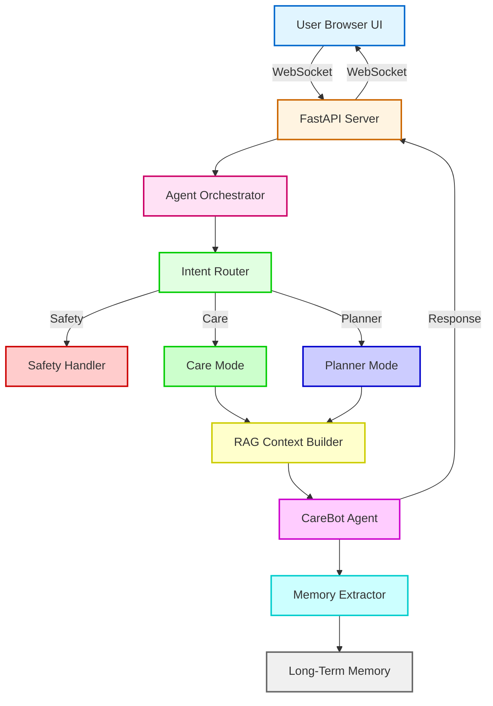

## 🧠 CareBot Agent

### Multi-Agent AI Assistant using AutoGen + Ollama + FastAPI

> A locally hosted, multi-agent mental health companion with streaming responses, FAISS memory, and full Docker support.

🔗 **Repository:** `https://github.com/Ujjwal0207/carebot-agent`

CareBot Agent is a **production-style, multi-agent conversational AI system** built using **Microsoft AutoGen**, **FastAPI**, **WebSockets**, and **local LLMs via Ollama**.

This project demonstrates how real-world AI assistants are designed using **agent orchestration**, **intent routing**, **memory extraction**, and **safe LLM integration** — without relying on paid APIs.

---

### 📋 Table of Contents

1. **Features**
2. **Architecture Overview**
3. **Agents**
4. **Intent Routing**
5. **RAG & Memory**
6. **Real-Time UI & Streaming**
7. **Tech Stack**
8. **Project Structure**
9. **Local Setup (No Docker)**
10. **Docker & Docker Compose**
11. **Memory Details (FAISS)**
12. **Streaming Details**
13. **Status & Roadmap**

---

## 🚀 Features

- **Empathetic mental-health-style conversation** tuned via AutoGen and custom prompts.
- **Multi-agent orchestration** for care, planning, routing, and memory extraction.
- **Real-time WebSocket UI** with “Thinking…” indicator and streaming-style responses.
- **FAISS-backed long-term memory** with semantic retrieval and basic de‑duplication.
- **Safety routing** to detect high‑risk messages and respond cautiously.
- Runs entirely on **local LLMs via Ollama** – no external API keys required.

This is **not a simple chatbot** — it is a **multi-agent AI system** designed with production-style patterns in mind.

---

## 🏗️ High-Level Architecture




## 📋 Request Flow

The complete request lifecycle from user input to response:

1. **User sends a message** via Browser UI using WebSocket connection
2. **FastAPI server** receives the message and forwards it to the Agent Orchestrator
3. **Intent Router** classifies the query into Safety, Care, or Planner mode
4. **RAG Context Builder** retrieves relevant long-term memory from the vector database
5. **CareBot Agent** generates a response using the LLM with enriched context
6. **Memory Extractor** identifies important information and stores it for future use


## Stateless vs Stateful Components

**Stateless Components**
- Browser UI
- FastAPI Server
- Agent Orchestrator
- CareBot Agent

**Stateful Components**
- Vector Memory (FAISS) – persists long-term user information


## 🤖 Agents in This System

### 1️⃣ CareBot Agent
- Built with `ConversableAgent`
- Provides empathetic, human-like responses
- Uses system prompts to guide tone and behavior

### 2️⃣ Memory Extractor Agent
- Automatically decides **what is worth remembering**
- Outputs structured JSON
- Stores long-term memory safely

> ⚠️ AutoGen is used **correctly**:  
> `generate_reply()` is used for LLM calls (not agent-to-agent chat with Ollama).

---

## 🔀 Intent Routing

Messages are routed before LLM invocation:

| Intent | Example |
|------|--------|
| `safety` | “I want to harm myself” |
| `care` | “I feel lost and overwhelmed” |
| `planner` | “What should I do next?” |
| `greeting` | “Hi”, “Hello” |

This keeps responses safe, relevant, and predictable.

---

## 📚 RAG (Retrieval-Augmented Generation)

- Past memory is retrieved when relevant
- Injected only into **system context**
- Prevents prompt leakage
- Reduces hallucinations
- Improves conversational continuity

---

## 📊 Evaluation & Benchmark

To evaluate the effectiveness of long-term memory, the agent was benchmarked in two modes:

- **Stateful execution**: Long-term memory enabled
- **Stateless execution**: Long-term memory explicitly cleared before the run

The benchmark was executed using an **asynchronous runner** to match the non-blocking design.

| Mode            | Context Awareness | Relevance     | Personalization |
| :-------------- | :---------------- | :------------ | :-------------- |
| Without Memory  | Low               | Generic       | None            |
| With Memory     | High              | Context-aware | Personalized   |

### 📝 Benchmark Execution

The benchmark can be run locally to compare agent behavior with and without memory:

```bash
PYTHONPATH=. python benchmark_memory.py
```

This script runs the same query twice—once with memory enabled and once after clearing memory—and prints both responses for qualitative comparison.

---

## ⚠️ Known Failure Cases

- **Repetitive responses**: The agent may occasionally generate similar replies when insufficient new context is available.
- **Memory noise**: Semantically related but irrelevant memories may be retrieved in edge cases.

Automated tests and controlled benchmarking help detect regressions related to memory retrieval and response stability.


## ⚡ Real-Time WebSocket UI

- **Instant responses**
- **“🤖 Thinking…” indicator**
- **Streaming-style updates** (chunks arrive over WebSocket, like GPT’s token stream)
- **No page reloads**


## 🛠 Tech Stack

| **Layer** | **Technology** |
|----------|----------------|
| Backend  | FastAPI |
| Real-time | WebSockets (FastAPI `WebSocket`) |
| Agents | Microsoft AutoGen (`ConversableAgent`) |
| LLM | Ollama (default: `llama3`) |
| Language | Python 3.9+ |
| Frontend | HTML + JavaScript |
| Memory | FAISS + Sentence-Transformers (`memory.index`, `memory.json`) |


## 📂 Project Structure

carebot-agent/
│
├── app/                          # Core AI logic
│   ├── main.py                   # Agent orchestration
│   ├── router.py                 # Intent classification & routing
│   ├── rag.py                    # Retrieval-Augmented Generation (RAG)
│   ├── memory.py                 # Memory persistence layer
│   ├── agent_care.py             # Empathetic CareBot agent
│   ├── agent_memory_extractor.py # Long-term memory extraction agent
│   ├── agent_planner.py          # Planner logic for structured guidance
│   ├── agent_memory.py           # Memory agent utilities
│   ├── safety.py                 # Safety & crisis handling
│   └── tools.py                  # Shared helper utilities
│
├── web/                          # Web layer
│   ├── server.py                 # FastAPI + WebSocket server
│   └── index.html                # Simple browser UI
│
├── config/
│   └── llm_config.py             # Ollama / LLM configuration
│
├── tests/                        # Test suite
│   ├── test_memory_retrieval.py  # Memory retrieval tests
│   └── test_rag_regression.py    # RAG stability tests
│
├── streamlit_app.py              # Optional Streamlit UI
├── benchmark_memory.py           # Memory benchmark script
│
├── memory.json                   # Stored long-term memory (JSON-based)
├── memory.index                  # FAISS index (auto-generated)
│
├── Dockerfile                    # Docker image for the app
├── docker-compose.yml            # Run App + Ollama together
├── .dockerignore                 # Docker ignore rules
│
├── .gitignore                    # Git ignore rules
├── requirements.txt              # Python dependencies
└── README.md                     # Project documentation


## ⚙️ Local Installation & Setup (No Docker)

### 1️⃣ Clone the repository

```bash
git clone https://github.com/Ujjwal0207/carebot-agent.git
cd carebot-agent
```

### 2️⃣ Create & activate virtual environment

```bash
python3 -m venv .venv
source .venv/bin/activate      # macOS / Linux
# .venv\Scripts\activate       # Windows (PowerShell / CMD)
```

### 3️⃣ Install dependencies

```bash
pip install -r requirements.txt
```

### 4️⃣ Install & run Ollama (local LLM)

- Download Ollama: `https://ollama.com`
- Pull the model:

```bash
ollama pull llama3
ollama serve
```

### 5️⃣ Run the FastAPI app

```bash
uvicorn web.server:app --host 0.0.0.0 --port 8000 --reload
```

Then open in your browser:

```text
http://127.0.0.1:8000/
```

You should see **CareBot (Ollama)** with streaming-style replies.

---

## 🐳 Docker & Docker Compose

This project includes **production-ready Docker configuration**:
- **`Dockerfile`**: Multi-stage build for the FastAPI app
- **`docker-compose.yml`**: Orchestrates Ollama + CareBot app together
- **`.dockerignore`**: Optimizes build context size

You can run everything in containers, including Ollama.

### 1️⃣ Build and run with Docker only

```bash
docker build -t carebot-agent .

docker run \
  -p 8000:8000 \
  -e OLLAMA_BASE_URL=http://host.docker.internal:11434 \
  --name carebot-agent-container \
  carebot-agent
```

Then visit `http://127.0.0.1:8000/` as usual.

### 2️⃣ Run **Ollama + App** together with Docker Compose

The included `docker-compose.yml` starts **two services**:

- `ollama`: the Ollama server inside Docker.
- `app`: the CareBot FastAPI app, pointing at `http://ollama:11434`.

From the project root:

```bash
docker compose up --build
```

Once both services are healthy, open:

```text
http://127.0.0.1:8000/
```

To stop:

```bash
docker compose down
```

---

## 🧠 Memory System (FAISS + JSON)

- **Embeddings**: `SentenceTransformer("all-MiniLM-L6-v2")`
- **Index**: FAISS `IndexFlatL2` stored in `memory.index`
- **Raw data**: list of `{ "text": ..., "category": ... }` in `memory.json`
- **Duplicate protection**:
  - Before saving a new memory, we check FAISS neighbors and skip **exact duplicates**.
  - Retrieval also de-duplicates by text so you don’t see the same fact repeated.

This makes the assistant’s long‑term memory **concise and non‑repeating**, while still giving the model rich context about the user.

---

## 🔁 Streaming Responses

- The backend (`web/server.py`) wraps each final response and:
  - Sends `"type": "thinking"` while work is in progress.
  - Streams word‑based chunks as `"type": "stream"` for a token‑like feel.
  - Finishes with `"type": "final"` containing the full text.
- The frontend (`web/index.html`) appends these chunks into a single `<li>` so you see the reply **build up live**, similar to ChatGPT / GPT‑style UIs.

---

## 💬 Optional: Streamlit UI (Richer Chat Experience)

If you prefer a richer, panel-style UI instead of the bare HTML page, you can use the included **Streamlit app**.

### 1️⃣ Install Streamlit (already in `requirements.txt`)

```bash
pip install -r requirements.txt
```

### 2️⃣ Run the Streamlit app

```bash
streamlit run streamlit_app.py
```

Then open the URL shown in the terminal (typically `http://localhost:8501`).

Features:

- Chat-style layout with user and assistant bubbles.
- Persistent conversation per browser session.
- “Thinking…” placeholder while the agent is generating a response.
- Easy “Clear conversation” button in the sidebar.

---

## 🧪 Testing & Validation

Basic automated tests are included to validate system stability and memory behavior:

- **Memory retrieval tests** ensure that stored facts can be retrieved when relevant.
- **RAG regression tests** verify that agent responses remain non-empty and stable across runs.

Tests are executed using `pytest` with async support to match the system's execution model.

### Running Tests

#### 1️⃣ Install Testing Dependencies

```bash
pip install -r requirements.txt
```

This installs `pytest` and `pytest-asyncio` (already in `requirements.txt`).

#### 2️⃣ Run All Tests

```bash
pytest tests/
```

#### 3️⃣ Run Specific Tests

```bash
# Test memory retrieval
pytest tests/test_memory_retrieval.py -v

# Test RAG response stability
pytest tests/test_rag_regression.py -v
```

#### 4️⃣ Run with Output

```bash
pytest tests/ -v -s
```

### Test Coverage

- **`test_memory_retrieval.py`**: Validates that stored memories can be retrieved via semantic search
- **`test_rag_regression.py`**: Ensures asking the same question twice returns non-empty, stable responses

### What Tests Validate

✅ **Memory Retrieval**: Stored facts are correctly retrieved when relevant  
✅ **Response Stability**: System doesn't crash or return empty responses  
✅ **Error Handling**: Graceful degradation when memory is empty


## ✅ Status & Roadmap

- **Streaming UI**: ✔
- **Multi‑agent orchestration**: ✔
- **FAISS semantic memory**: ✔ (with basic deduplication)
- **Docker image**: ✔
- **Docker Compose (Ollama + app)**: ✔

This repository is a solid starting point for experimenting with **local, production-style AI agents**. Feel free to fork and extend it with authentication, richer UI, or additional agents.